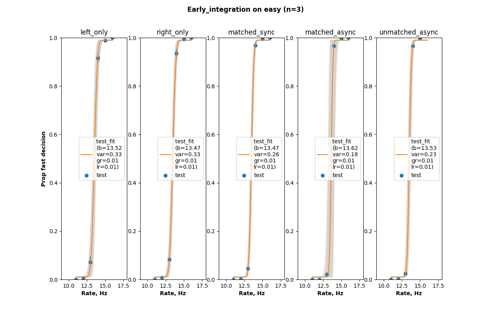
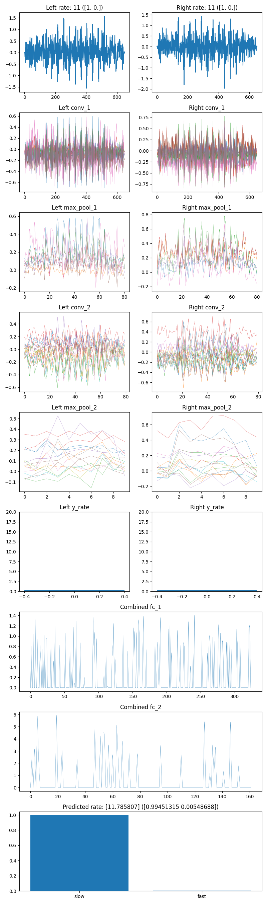

# Deep multi-sensory integration models
 [](https://sonarcloud.io/dashboard?id=garethjns_MSIModels)

Trying out early and late integration in multi-input neural networks, for event detection and rate discrimination.

Contents:  
1) [Setup](#setup)  
2) [Background](#background)  
3) [Main experiment results](#main_experiment_results)  
4) [Custom experiments](#custom_experiments)  

# Setup <a name="setup"></a>
```bash
git clone https://github.com/garethjns/MSIModels.git
cd MSIModels
pip install -r requirements.txt
```

## Run experiment

### Python
Run main experiment:
```bash
python3 run.py
```

Or, Run smaller example experiment:
```bash
python3 -m scripts.run_full_experiment
```

#### View results
1) Run MLflow server. Use a Linux VM or WSL if running project in Windows.
    ````bash
    mlflow ui
    ````
2) View at http://localhost:5000
3) And "contained_experiment/_[run_number]"


### Docker container
Build the docker container:
```bash
docker build . -t msimodels
```
And run to access results folder at /tmp/msi and mlflow server at http://localhost:5000 
```
mkdir /tmp/msi/
docker run -p 5000:5000 --mount type=bind,source=/tmp/msi,target=/contained_experiment msimodels
```

# Background <a name="background"></a>
The human brain integrates incoming information over time, and combines evidence between different sensory modalities. Humans are able to use sensory information in a statistically-optimal fashion; reliable information is weighted as more important than unreliable or noisy information. However, exactly how and where the brain combines modalities is unclear, with multisensory processing occurring early in the cortex in cortices traditionally believed to be unisensory.

This project sets up analogies of two models of evidence integration - early and late - in ANNs and has two main aims:
 - To see how performance varies with "where" the integration occurs.
 - Compare the results to those observed in mammals, particularly with regard to 
    - The effect of temporal asynchrony between sensory modalities.
    - Which parts of the stimuli are most import for decision making.

### Early vs late integration
In early integration models, multisensory processing first occurs in sensory cortices (not necessarily exclusively). In late integration models, modalities are processed separately by the appropriate sensory cortices and then combined in later, decision making cortices (such as parietal and frontal) [[1](http://www.sciencedirect.com/science/article/pii/S0959438816300678)].  

Behavioural evidence implies late integration occurs [[2](http://www.jneurosci.org/content/32/11/3726.short)], anatomical evidence tends to imply integration occurs early and late.

## The task
Given noisy "sensory" input, the aim is to categorise the stimuli as "fast" or "slow", depending on the number of events in the input.

In the psychosocial version of this task, the appropriate fast/slow threshold is learned by the subject, and events are, for example, light flashes or tone pips that are embedded in a noisy background. 

For the neural networks, the events are the same, and the task is binary classification with a decision threshold set according to the mean of the known stim rates. In order to reach the final decision, each each individual component of the network performance sub-tasks such as event detection, rate estimation, etc.  These losses are also monitored.

## Stimuli
The stimuli used are based on those used in a number of psychophysical tasks (eg. [[2](http://www.jneurosci.org/content/32/11/3726.short), [3](http://www.eposters.net/poster/exploring-the-role-of-synchrony-in-auditory-visual-integration-in-ferrets-and-humans), [4](http://www.eposters.net/poster/exploring-the-role-of-synchrony-in-spatial-and-temporal-auditory-visual-integration-1)]). The stimuli are either "unisensory" (single channel input) or "multisensory" (two-channel input).   

Each channel consists a number of events embedded in a noisy background. These events are separated by gaps of two discrete lengths. For comparison, in a auditory and visual psycphysics task, these inputs are analagous to the raw voltage traces used to drive speakers (AC) and LEDs (rectified). In this case, the
event might be a short flash (~20 ms) for the visual channel, and a a short tone pip (~20 ms) for the auditory channel.

In the multisensory case, the two channels can be:
 - Matched: The same number of events on each channel
   - Asynchronous: Matched, but events between channel temporally aligned between channels
   - Synchronous: Matched AND the events align temporally between channels
 - Unmatched: 
   - Agreeing: Differing number of events on each channel, but indicating the same decision (ie. both "fast" or both "slow")
   - Conflicting: Differing number of events on each channel, and indicating contradictory decisions (ie. one "fast, one "slow")

 

## Models
The models represent experimental subjects that use different strategies to make their decision. They have two inputs and multiple outputs, and the total number of parameters in each model is roughly matched at ~160,000.

### Inputs
2 Channels, nominally "left" and "right" or "auditory" or "visual" to reuse terminology from the psychophysics task. Each channel takes input similar to the voltage trace stimuli for the auditory stimuli plotted above, rather than the square wave signal designed for use with LEDs. 

Each channel connects to an branch containing 1D convolutional layers. Where this branch merges defines the model type (see below).

### Output
There are two main outputs for the network, a binary "fast" or "slow" decision and a linear "rate" estimation. By default the loss weights are 50/50 for these. The binary decision is used to evaluate model performance.

There are additional outputs at the layers before the input branches merged. By default the loss weights for these are set to 0, and these outputs have no effect on training. Modifying the weights of the outputs allows creation of models that either focus on the final decision, or the intermediate event detection stages. See also [model debug](#model_debug)

### Architectures
#### Early
 
#### Intermediate
 
#### Late
 

# Main experiment results <a name="main_experiment_results"></a>  
The main experiment is defined in run.py, which can either be run using Python, or built into a Docker container which will also run the results server.

```bash
python3 run.py
```

## Experimental setup
 - 3 Model types - early, intermediate, late integration (see above)
 - 4 datasets (50k rows each) - easy, medium, hard, very hard (see below) and containing:
     - 5 Types of stimuli 
        1) Left channel only
        2) Right channel only
        3) Multisensory matched, sync
        4) Multisensory matched, async
        5) Multisensory unmatched, async
  - 3 Repeats of each model on each dataset

## Experimental stimuli
### Types
Examples from the "easy" set.  
#### Type 1: Left channel only
  
#### Type 2: Right channel only

#### Type 3: Multisensory matched, sync 
  
#### Type 4: Multisensory matched, async 

#### Type 5: Multisensory unmatched, async 
  

### Difficulty
4 levels ranging from easy to hard. Examples of type 3 at each difficulty:
#### Easy

#### Medium  

#### Hard  

#### Very hard  
  

### Overall model accuracy
  
Averaging over all stimuli types, early model is most accurate on all datasets. Increasing difficulty (stim noise) decreases performance and variability. Intermediate and late models perform similarly.

| Model | Dataset: Easy | Medium | Hard | Very hard |  
|---|---|---|---|---|
| Early | 0.985 ± 0.002 | 0.945 ± 0.005 | 0.894 ± 0.004 | 0.672 ± 0.032 |
| Intermediate | 0.951 ± 0.004 | 0.888 ± 0.005 | 0.832 ± 0.017 | 0.652 ± 0.020 |
| Late | 0.946 ± 0.003 | 0.885 ± 0.007 | 0.825 ± 0.008 | 0.636 ± 0.015 |

### Discrimination thresholds
Discrimination thresholds are calculated from the psychometric curve fits, see [PsychometricCurveFitting](https://github.com/garethjns/PsychometricCurveFitting) for more info. Intuitively, the lower this threshold, the fewer events are required to flip a decision from fast to slow.  

#### Unisensory: Types 1 and 2
   
Performance for all model types is consistent across types - this is expected. Stimuli on each channel are generated in the same way, and models are symmetrical, so inconsistency in performance would indicate a problem. Similar to decision accuracy, performance decrease (discrimination threshold increases) as difficulty increases. Variability also increases. The early integration model generally performs best.

#### Multisensory: Types 3
    
All 3 models perform between on type 3 stimuli than type 2. They are able to extract more useful information from the stimuli when it is presented on two channels synchronously (note, events are synchronous across channels, but background noise is independent). The early integration model performances best across all difficulties.

#### Multisensory: Type 4
  
All 3 models perform between on type 4 stimuli than type 2. They are able to extract more useful information from the stimuli when it is presented on two channels asynchronously (note, there are the same number of events in each channel, but they are presented asynchronously between channels, and background noise is independent). Again, the early integration model performances best across all difficulties.  Performance between type 3 and 4 is similar. 

### Psychometric curves
#### Early integration model

  
  
  

#### Intermediate integration model
  
  
  
  

#### Late integration model
  
  
  
  

#### Psychometric curves summary
Discrimination threshold averaged over types and repetitions.  

| Model | Dataset: Easy | Medium | Hard | Very hard |  
|---|---|---|---|---|
| Early integration | 0.234 ± 0.013 | 0.42 ± 0.077 | 0.492 ± 0.036 | 3.025 ± 0.536|
| Intermediate integration | 0.427 ± 0.027 | 0.852 ± 0.116 | 1.159 ± 0.051 | 3.72 ± 0.424 |
| Late integration | 0.455 ± 0.007 | 0.677 ± 0.08 | 1.02 ± 0.052 | 4.104 ± 0.189 |

# Custom experiments <a name="custom_experiments"></a>
The main experimental entrypoint is the Experiment object and is the best place to start. It can be used to fairly-flexibly define experiments and handles a lot of house keeping. The lower level objects are also public and usable independently for more customised experiments. 

Roughly the structure of an Experiment is:

 - Experiment (class)
   - ExperimentalResults
     - Methods fo plotting and evaluation (comparison across model and data types)
   - ExperimentalRun
     - ExperimentalModel (x n repeats)
       - MultisensoryModel of type early, intermediate, or late integration
        - Single Model plotting and evaluation methods 
     - ExperimentalDataset (x 1)
       - Data summary and plotting methods
       - MultiChannel
         - Methods stimuli loading, splitting between train, test, etc.
   - ExperimentalRunResults
     - Methods fo plotting and evaluation (aggregated over n runs or "subjects")

See scripts/ for example usage of each object, and below (although this may be slightly out of date)

## Experiment class
The Experiment class is constructed from ExperimentalModels and ExperimentalDatasets. For each, it generates ExperientalRuns to handle running multiple repeats.  

Results are persisted to mlflow into two experiments:
 - *[name]_summary*
   - Contains summary results, with a run for each model.
 - *[name]*
   - Contains a run for every stimulus type, for every subject.

And into the folder [experiment_name]/_[run number]/

Small example (scripts/run_full_experiment.py):
```python
from msi_models.experiment.experiment import Experiment
from msi_models.experiment.experimental_model import ExperimentalModel
from msi_models.models.conv.multisensory_classifier import MultisensoryClassifier
from msi_models.experiment.experimental_dataset import ExperimentalDataset

N_REPS = 5
N_EPOCHS = 2000
N_DATA_ROWS = 5000

# Prepare experiment
exp = Experiment(name='scripts_example_experiment', n_epochs=N_EPOCHS, n_reps=N_REPS)

# Prepare and add data (data doesn't need to have been pre-generated)
for exp_data in [ExperimentalDataset("scripts_example_easy",
                                     n=N_DATA_ROWS, difficulty=12).build("data/scripts_example_mix_easy.hdf5"),
                 ExperimentalDataset("scripts_example_hard",
                                     n=N_DATA_ROWS, difficulty=12).build("data/scripts_example_mix_hard.hdf5")]:
    exp.add_data(exp_data)

# Prepare and add models
common_model_kwargs = {'opt': 'adam', 'batch_size': int(min(N_DATA_ROWS / 10, 15000)), 'lr': 0.01}
for int_type in ['early_integration', 'intermediate_integration', 'late_integration']:
    mod = ExperimentalModel(MultisensoryClassifier(integration_type=int_type, **common_model_kwargs), name=int_type)
    exp.add_model(mod)

# Run experiment
exp.run()
```

## Data preparation
Individual stimuli are constructed with [AudioDAG](https://github.com/garethjns/AudioDAG) and combined into datasets using msi_models.stimset.channel and msi_models.stimset.multi_channel objects.

Templates are available for different stimulus components, types and combinations of stimuli. The typically specify compatible defaults for the params, which can be modified.

MultiTwoGapStim.generate creates a .hdf5 file with the following structure:
```
    |--left/
            |--x (n, duration_pts, 1)
            |--x_indicators (n, duration_pts, 1)
            |--y_rate (n,)
            |--y_dec (n,)
            |--configs 
    |--right/
            |--x (n, duration_pts, 1)
            |--x_indicators (n, duration_pts, 1)
            |--y_rate (n,)
            |--y_dec (n,)
            |--configs 
    /--agg/
           |--y_rate
           |--y_dec
           |--summary (df)  
           |--summary_train (df)  
           |--summary_train (df)
```

Generating multisensory (two channel) using templates:

```python
from msi_models.stim.multi_two_gap.multi_two_gap_stim import MultiTwoGapStim
from msi_models.stim.multi_two_gap.multi_two_gap_template import MultiTwoGapTemplate

MultiTwoGapStim.generate(templates=MultiTwoGapTemplate['matched_async'], n_jobs=-1,
                         fs=500, n=200, batch_size=10, fn='data/sample_multisensory_data_sync.hdf5',
                         template_kwargs={"duration": 1300,
                                          "background_mag": 0.09,
                                          "duration_tol": 0.5})
```

This data is read using Channel definitions, and the MultiChannel object for combining channels:

````python
from msi_models.stimset.channel_config import ChannelConfig
from msi_models.stimset.multi_channel import MultiChannel
from msi_models.stimset.multi_channel_config import MultiChannelConfig

# Create channel configs to load for /left/ and /right/ keys
path = 'data/sample_multisensory_data_sync.hdf5'
common_kwargs = {"path": path, "train_prop": 0.8, "seed": 100,
                 "x_keys": ["x", "x_mask"], "y_keys": ["y_rate", "y_dec"]}
left_config = ChannelConfig(key='left', **common_kwargs)
right_config = ChannelConfig(key='right', **common_kwargs)

# Combine the channels and define aggregate (/agg/) key to use as y(s)
multi_config = MultiChannelConfig(path=path, key='agg', y_keys=["y_rate", "y_dec"],
                                  channels=[left_config, right_config])
mc = MultiChannel(multi_config)

# View some examples
````

Additional examples:  
 - scripts/generate_single_stim_from_template_examples - example stims  
 - scripts/generate_single_type_multisensory_data - generate data to files  
 - scripts/generate_multi_type_multisensory_data - generate multiple datatypes to one file to create training and test sets  
 - scripts/generate_unisensory_data.py - generate unisensory data  

### ExperimentalDataset
The ExperimentalDataset class specifies a dataset for use in experiments. It will automatically generate the data file if it doesn't exist and the appropriate Multichannel object to read and partition the data.

eg. 
```python
from msi_models.experiment.experimental_dataset import ExperimentalDataset

exp_data = ExperimentalDataset("example_mix", n=500, difficulty=70).build("data/example_mix.hdf5")

exp_data.mc.plot_summary()
exp_data.mc.plot_example()
exp_data.mc.plot_example()
```

## Model preparation

### Single model fitting
Model templates are available in msi_models.models.conv.multisensory_templates, and define combinations of loss weights to create a binary classifier, event detector, etc. MultisensoryClassifier creates a model aims to correctly predict rate and the "fast"/"slow" decision.

The MultisensoryClassifier uses the agg/y_rate and agg/y_dec as output, targets, but also calculates the loss for the against the unisensory targets, eg left/y_rate and left/y_dec so the performance of the individual outputs can also be monitored.

The channels are first defined, then combined into a MultiChannel object to feed the model with pre-generated data (stored in hdf5), see generations scripts above.

Examples of usage are shown in:
Additional examples:  
 - scripts/train_unisensory_model.py   
 - scripts/train_multisensory_model.py    

## Model debug <a name="custom_experiments"></a>

